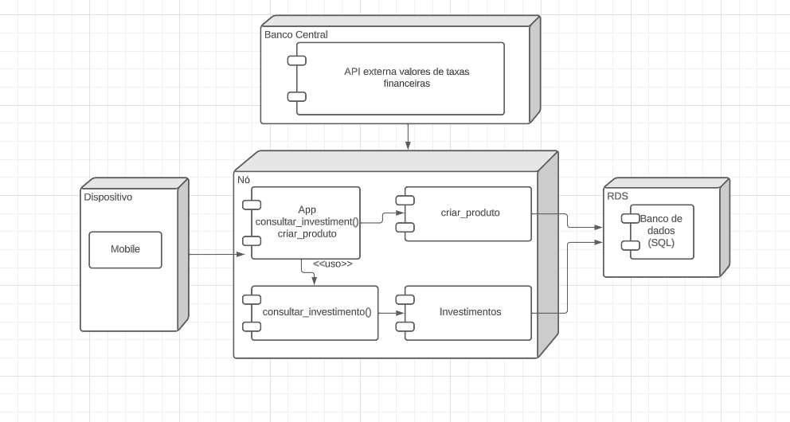

# Itens

## 1. Arquitetura

Os arquivos foram separados em Model, View e Controller. Por isso, o diagrama comtempla o que está presente em cada arquivo.

## 2. Modelo Lógico

A relação de hierarquia no modelo, já que CDB é um tipo de produto financeiro, portanto, recebe os métodos: Valor() e Juros()

